# Separate and Specialize: A Pilot Study on Stablizing Nvdiffrec for Shiny Surface Texture Recovery 

This project is based on [nvdiffrec](https://github.com/NVlabs/nvdiffrec) by NVIDIA.  
The original code is released under the [NVIDIA Source Code License](https://github.com/NVlabs/nvdiffrec/blob/main/LICENSE.txt).  
All modifications in this repository are provided under the same license terms.

# Install

Please follow the same instruction to install the same environment as [Nvdiffrec](https://github.com/NVlabs/nvdiffrec).

**For RTX5090 user:**
1. Install Python3.12 in your environment
```bash
conda create -n dmodel python=3.12
conda activate dmodel
```
2. Install [CUDA Toolkit 12.8](https://developer.nvidia.com/cuda-12-8-0-download-archive)

3. Download the latest stable PyTorch version:
```bash
pip install torch torchvision torchaudio --index-url https://download.pytorch.org/whl/cu128
```

4. 
```bash
pip install ninja imageio PyOpenGL glfw xatlas gdown
pip install git+https://github.com/NVlabs/nvdiffrast/
imageio_download_bin freeimage
```
5. Download tiny-cuda-nn
```bash
export TCNN_CUDA_ARCHITECTURES=120
pip install git+https://github.com/NVlabs/tiny-cuda-nn/#subdirectory=bindings/torch
```

**Run:**
```bash
python train.py --config configs/sphere.yaml
```

# Overview:

**TL;DR:** 
I modified the material optimization by splitting it into two branches, each with different learning rates and loss functions.  
The goal was to improve texture recovery without requiring manual per-asset configurations. Here I present what I tried and what I observed.


# Issue Explanation

In the Nvdiffrec pipeline, users need to set specific limits on metallic, roughness or albedo values, otherwise, the system may produce incorrect textures that cause noticeable errors in the final render when lighting conditions change.

Without specific configurations, such as increasing the supersampling value or manually set maximum value for certain channels, sometimes the optimization process can become unstable, failing to recover low roughness properties. Especially for shiny surface contains dark color areas, Nvdiffrec can misclassify the black regions as high roughness and high metallic areas. 

This behaviour likely comes from the fact that in Nvdiffrec, all material properties: Albedo, Normal, Roughness, Metallic and optionally Occlusion, are predicted by one network, which can lead to entanglement between them.

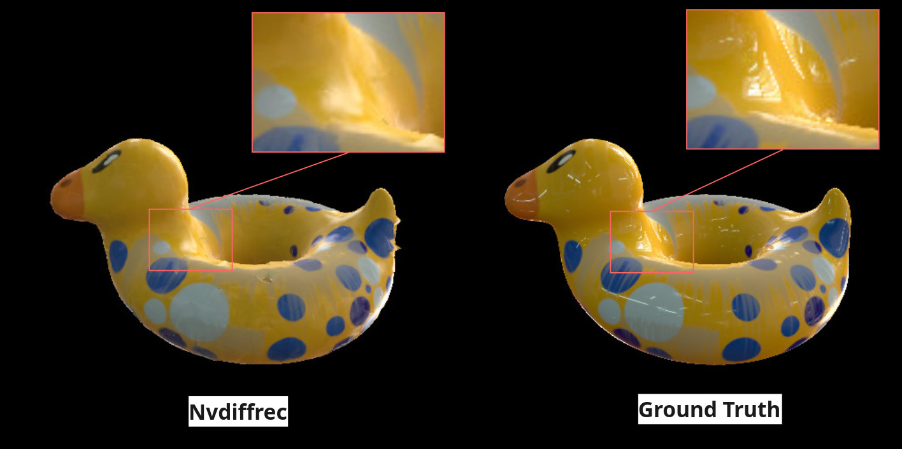
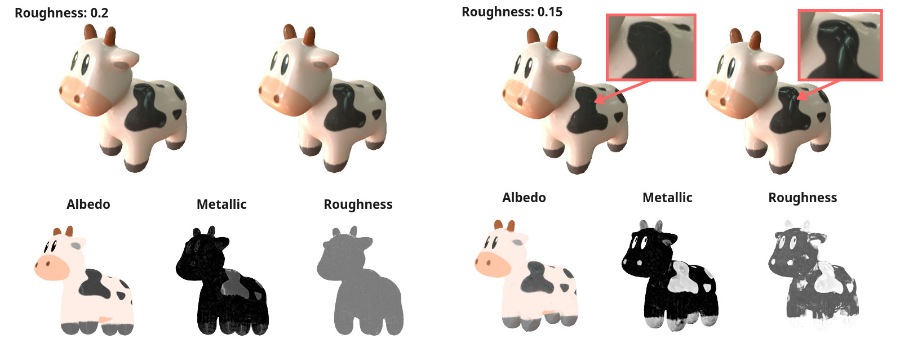


# Our method
### Main Idea:
Inspired by the manual 3D asset creation workflow, I implement a “separate then specialize” strategy: The network first "focus on" the most visually dominant attribute (mesh and color), then progressively refine the reflectance properties.
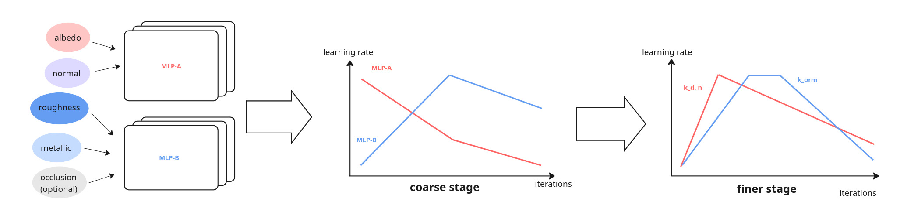

I separate the material optimization into two branches. One branch predicts Albedo and Normal, while the other one predicts Roughness and Metallic. Each branch is trained with a different learning rate, to reduce the entanglement that often occurs in the joint optimization . Moreover, each branch is tailored with specific weighted composite losses. The purpose is to make MLP-A less sensitive to specular highlights, but encourage MLP-B to not miss them.

In practice, the best performance was achieved with :

Where Loss2 for MLP-B needs to be an outlier-sensitive loss (e.g. MSE), while others use outlier-robust loss functions, such as LogL1, SMAPE.


### Other Implementations:
**Logging:** <br>
Implemented TensorBoard logging to visualize losses, learning rates, and compare metrics more directly.

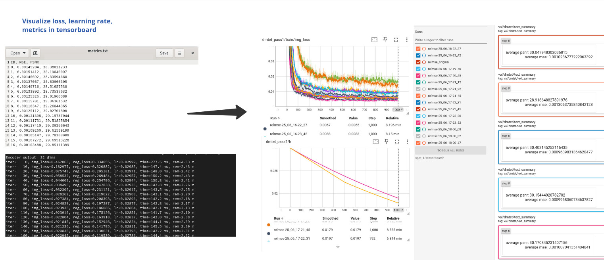

**Unpack textures:** <br>
Unpacked textures from the packed ORM map into separate occlusion, roughness, and metallic texture maps, making it easier to identify which channel is incorrect.

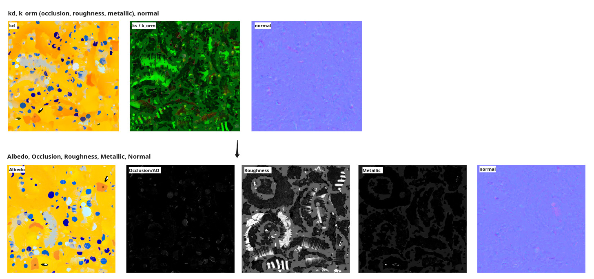

# Result:


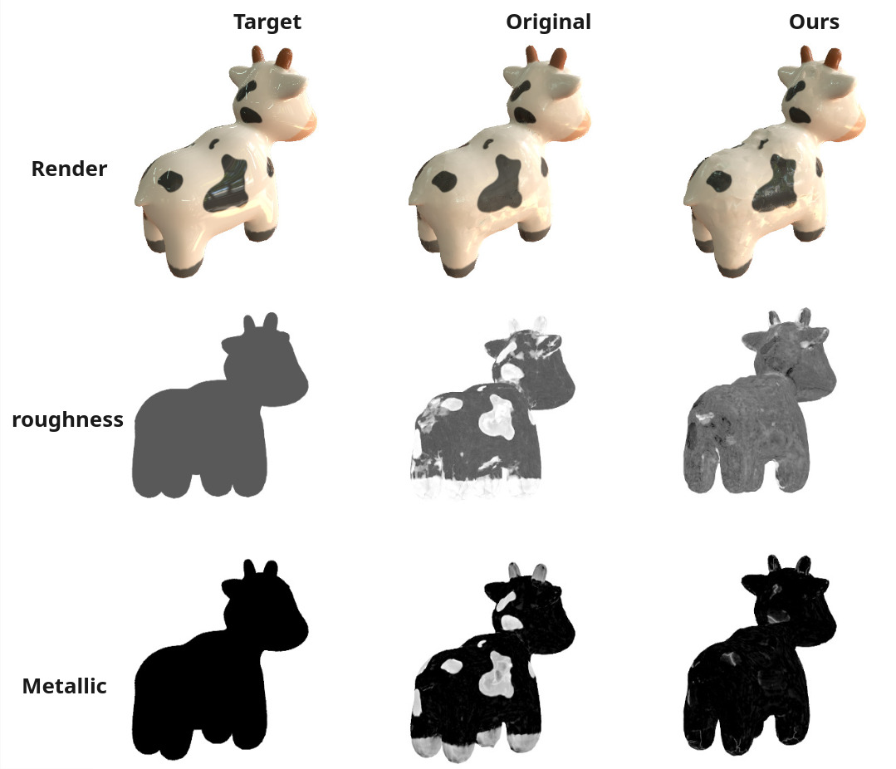


All experiments were run for 1000 iterations, no super-sampling, only occlusion channel disabled (because Nvdiffrec pipeline only support direct lighting, and we are testing synthetic data). Generated texture maps have a resolution of 1024×1024, and training renders were 512×512. All tests were run on a Linux machine with an NVIDIA RTX 5090. The loss function selected for testing the original method was RELMSE.


In our experiments, the method showed some improvements in recovering textures. We observed fewer cases of dark regions being misclassified and generally lower recovered roughness values. In the joint lighting optimization task, it also gave better HDRI results on shiny-surface assets.


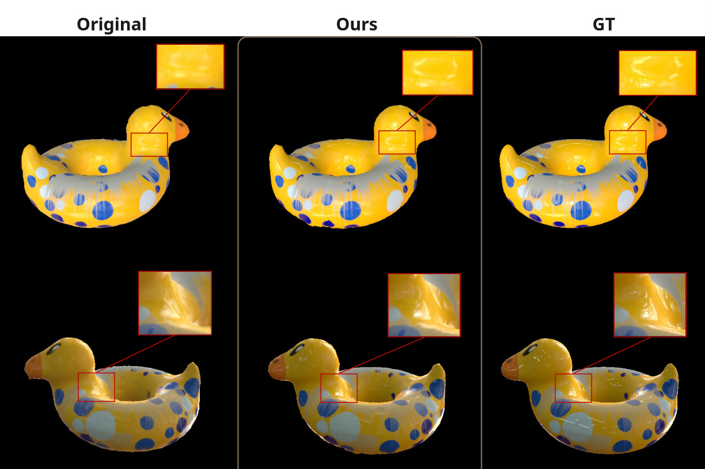

Customized grey ball asset.

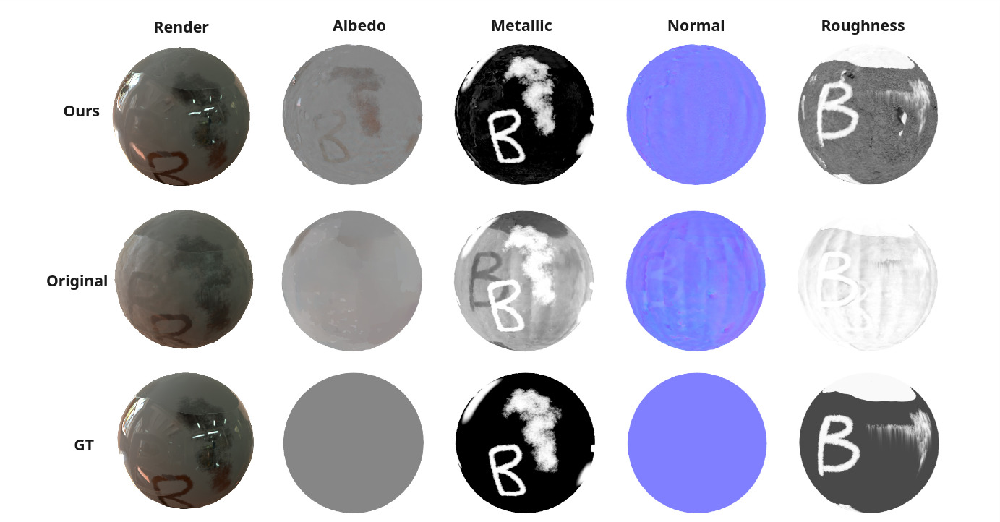


**Joint lighting optimization**

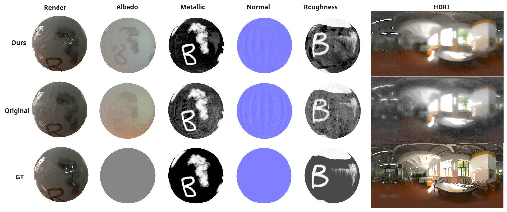
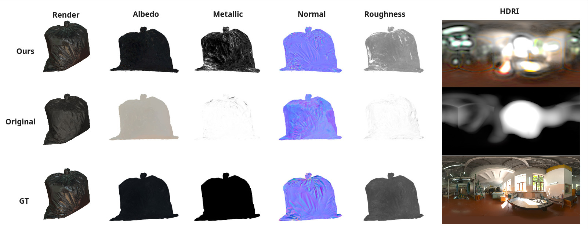

The original nvdiffrec already works very well on most synthetic data cases. My modification is more of an experimental attempt: it shows improvements in some challenging situations, but it is not a universal fix, there are also situations where both the original nvdiffrec and my method still fail.

# Limitations & Future works:

### Training time
The training time is about 3-4 times longer. This can be mitigated by adjusting the specifications of the [multiresolution hash encoding](https://github.com/NVlabs/tiny-cuda-nn). Reducing the number of levels from 16 to 4 decreases the training time from 8.581 minutes to 4.688 minutes. While this reduction lowers the level of detail in the coarse stage, the finer stage can recover the details.It also helps the mesh to become less affected by "invisible holes" (although this issue mainly comes from the current renderer being limited to direct lighting. A more meaningful discussion would be after switching to a renderer that supports indirect lighting such as [Nvdiffrecmc](https://github.com/NVlabs/nvdiffrecmc)).


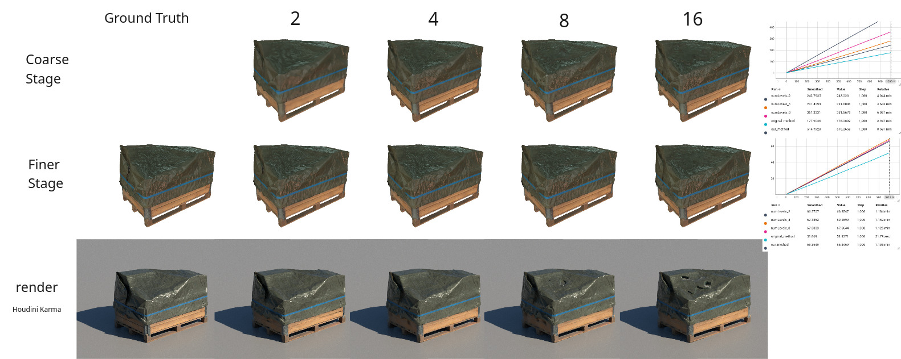


### Metric

Since our goal is to recover accurate textures, directly comparing final rendered images with the reference does not always reflect the true quality. For example, in the case shown: the left result correctly recovers the shiny surface while the right one fails to, but the metric still scores better on the right one.

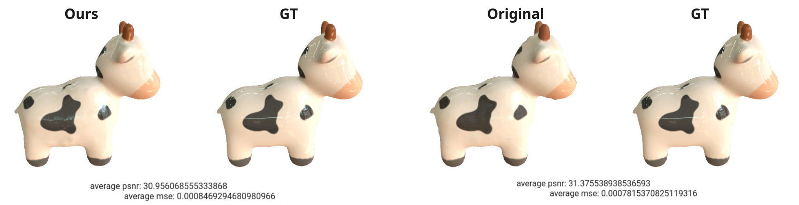

A direct texture-to-texture comparison would be ideal for our goal. Of course, this is not possible for real captured datasets, where ground-truth textures are unavailable. One idea for future work is to bridge this gap: using 3D DCC tools (e.g., Houdini) to render datasets that are closer to real-world conditions while also providing ground-truth textures. Such datasets could serve as useful testbeds to evaluate and improve differentiable rendering methods. Since automatic UV unwrapping generates a different UV layout in each training run, comparison in 2D space is not possible. Developing a method to compare textures in 3D space is left for future work.  Camera information can be exported via USD and converted into LLFF format (I include a simple conversion script [here](./addtion/USDtoNPY.py) and [here](./addtion/USDtoNPY_turntable.py)). Aligning the HDRI orientation is not implemented yet and is also left for future work.


**Notes:** I tried to keep this page short and focused to reduce reading time. For full details, please ask me for the complete project report. Feedback and suggestions are very welcome, especially corrections if you notice any issues with these experiments.